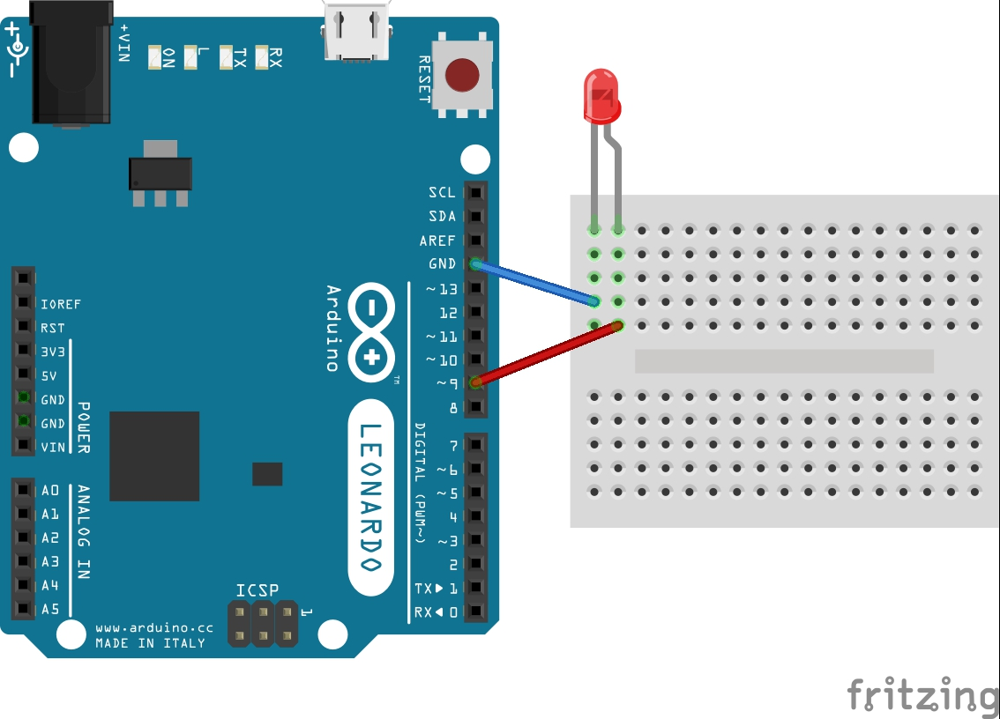
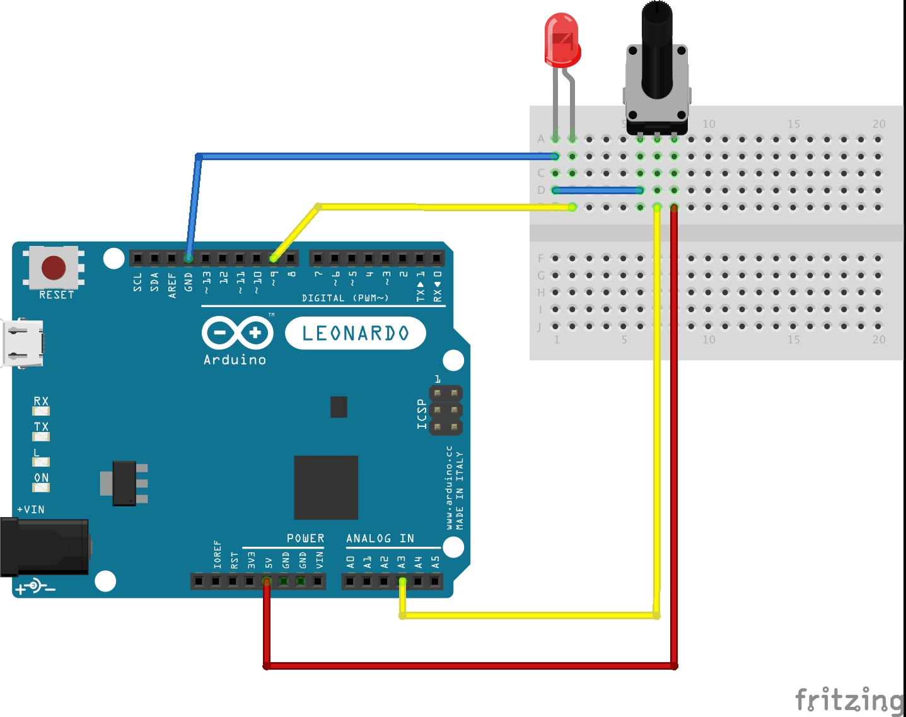
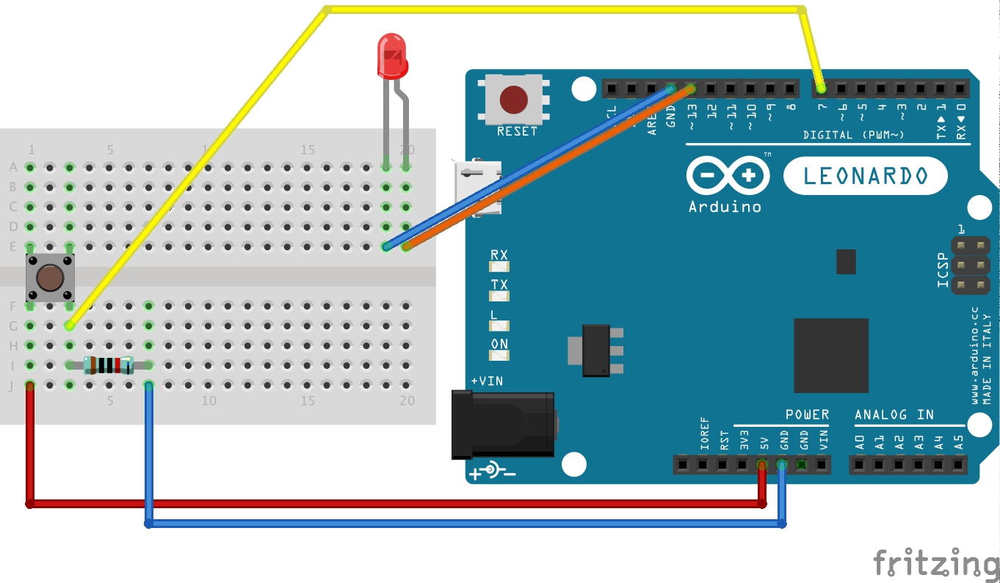
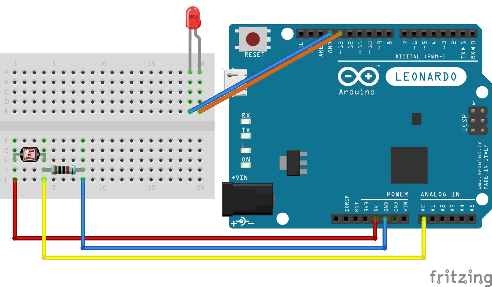
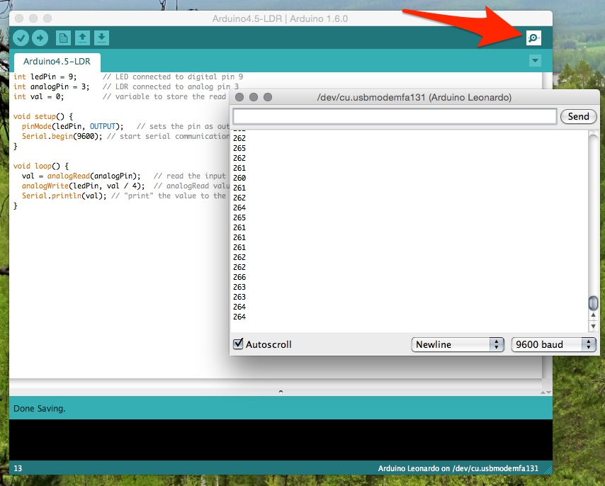
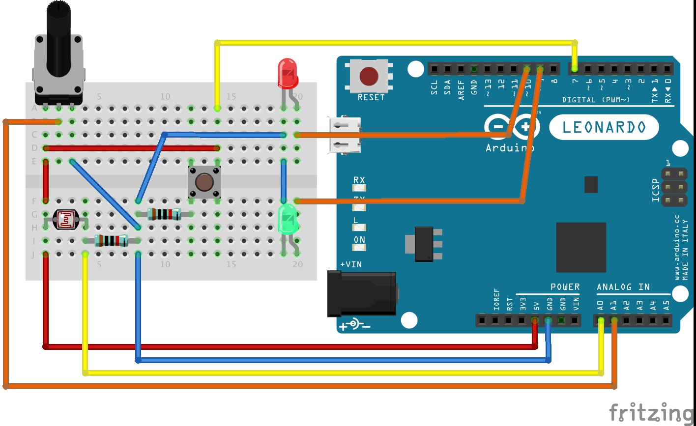
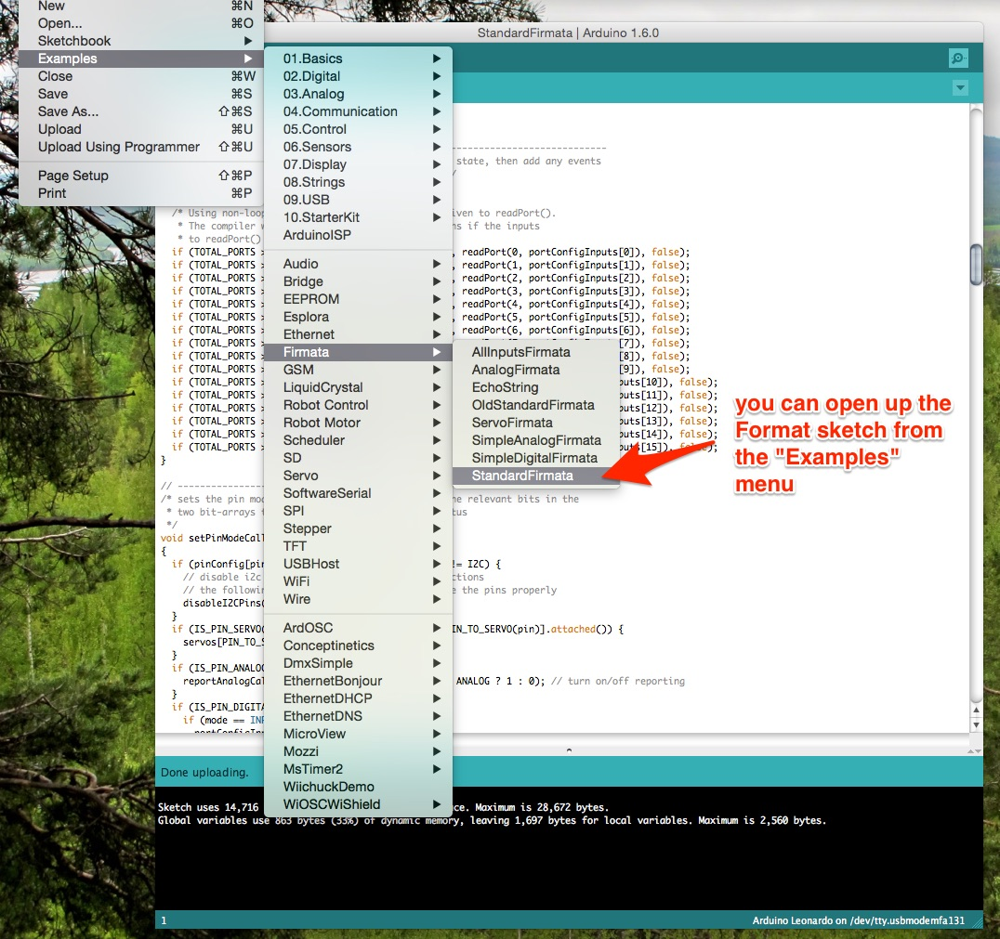
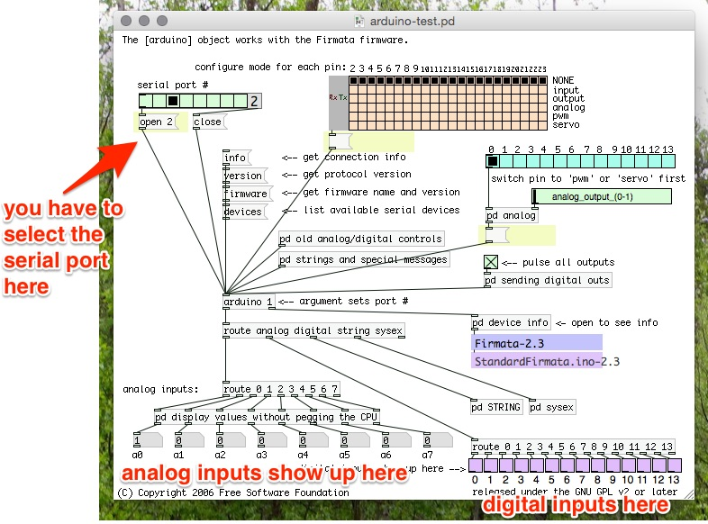

# EMS Arduino Tutorial

This is a 1-day tutorial in how to make musical interfaces with Arduino!

Arduino is an hardware platform for quickly and easily making physical computing objects. In computer music, Arduino is often used to build custom controllers for interacting with computer based sound. Want to mount extra electronic buttons on your instrument, make a wearable movement sensor, or make an instrument that reacts to changes in weather? Arduino can help you do all this and more.

The best thing about Arduino is that it's designed to be easy for beginner makers to get started, but is also useful for hardcore hackers.

In this course, you'll learn how to do some of the basic Arduino tasks. Arduino projects are always a combination of hardware and software, the workflow usually works like this:

0. Do some research online for what you want to do ([arduino.cc](http://arduino.cc) is usually a good place to start!)
1. Make a small circuit for your sensor or actuator.
2. Write a little program in the Arduino software editor.
3. Upload the program to the Arduino board.
4. Go have fun with it!

There are lots of versions of Arduino, and it's open source hardware so there are lots of variations and suppliers of similar hardware. We're using a version of the latest kind of Arduino called the "Leonardo". This series of Arduino is great - it has some really great USB features where it can pretend to be a USB keyboard and mouse, and even a MIDI device. However - the Leonardo is a bit new, so some older instructions or shields might not work properly.

## Project 0. Install the software!

#### Download and install the Arduino programming environment:

Go get the software: [arduino.cc/en/Main/Software](http://arduino.cc/en/Main/Software). It's fine to get version 1.0.6 rather than the beta. The software is available for Windows, OS X, and Linux!

#### Installing Drivers

- On Mac OS X you don't need to install any drivers, but when you first plug in your Arduino Leonardo, you should see a "Keyboard Setup Assistant" box - this is normal!
- On Windows, you'll need to select a driver that comes with the Arduino software, here's the details: [Windows Driver Details](http://arduino.cc/en/Guide/ArduinoLeonardoMicro#toc10).

## Project 1. Blinking an LED!

#### Set up the circuit

You'll need the breadboard, an LED and two jumper wires from your kit. Setup this circuit:

#### Blinking Code:

Here's the code for blinking the LED - copy and paste this into the Arduino software.

    int ledPin = 9;      // LED connected to digital pin 9  

    void setup () {
      pinMode(ledPin, OUTPUT); // Enable pin 13 for digital output
    }

    void loop () {
      digitalWrite(ledPin, HIGH); // Turn on the LED
      delay(1000); // Wait one second (1000 milliseconds)
      digitalWrite(ledPin, LOW); // Turn off the LED
      delay(1000); // Wait one second
    }

Before you can send the code to the Arduino, you have to select it in the "Tools" menu. Go into "Tools -> Board" and select "Arduino Leonardo". The Arduino uses a kind of communication port called "serial", computers used to have big 9 pin serial ports, but these days this runs over USB connections. There are a usually a couple of serial ports on the computer and it can't automatically figure out which one is which. In the "Tools -> Port" menu, the Leonardo shows up as "/dev/cu.usbmodemfd121 (Arduino Leonardo)". This will look a bit different on windows.

When you've selected the Arduino press the "upload" button in the top left!

#### Everything should be working!

Try changing some stuff in the program? The times, or the digital pin for the LED?

Hot tip: Pin 13 on the Arduino is actually connected to an LED on the board labelled L!

## Project 2: Controlling an LED with a potentiometer

#### Circuit:

#### Code:

    int ledPin = 9;      // LED connected to digital pin 9  
    int analogPin = 3;   // potentiometer connected to analog pin 3  
    int val = 0;         // variable to store the read value

    void setup() {  
      pinMode(ledPin, OUTPUT);   // sets the pin as output  
    }

    void loop() {  
      val = analogRead(analogPin);   // read the input pin  
      analogWrite(ledPin, val / 4);  // analogRead values go from 0 to 1023, analogWrite values from 0 to 255  
    }

## Project 3: Controlling an LED with a Button.

#### Circuit:

#### Code:

    const int LED = 9; // the pin for the LED
    const int BUTTON = 7; // the input pin where the // pushbutton is connected
    int val = 0; // val will be used to store the state // of the input pin

    void setup() {
      pinMode(LED, OUTPUT); // tell Arduino LED is an output pinMode(BUTTON, INPUT); // and BUTTON is an input
    }

    void loop() {
      val = digitalRead(BUTTON); // read input value and store it
      if (val == HIGH) {
        digitalWrite(LED, HIGH); // turn LED ON
      } else {
        digitalWrite(LED, LOW);
      }
    }

## Project 4: Sensing light

#### Circuit:

#### Code:

    int ledPin = 9;      // LED connected to digital pin 9  
    int analogPin = 3;   // LDR connected to analog pin 3  
    int val = 0;         // variable to store the read value

    void setup() {  
      pinMode(ledPin, OUTPUT);   // sets the pin as output  
    }

    void loop() {  
      val = analogRead(analogPin);   // read the input pin  
      analogWrite(ledPin, val / 4);  // analogRead values go from 0 to 1023, analogWrite values from 0 to 255  
    }

## Project 4.5: Sending data to the computer

In this project, we're adding a few lines of code to the previous sketch to send the signal from the LDR to the computer.

The easiest way to send data from the Arduino to the computer is using the Serial connection over USB. All you have to do is call "Serial.begin(9600)" in setup() to get started. Then whenever you have some data you can call "Serial.println("Hello World!")".

The Arduino IDE has a special window to receive these serial messages. But you can also receive them in Pd, Max, and every other programming language.

A common design pattern with Arduino is to send data over serial, have a small program written in Processing or another language that repeats the messages as MIDI data to control Ableton or another commercial application.

#### Code:

    int ledPin = 9;      // LED connected to digital pin 9  
    int analogPin = 3;   // LDR connected to analog pin 3  
    int val = 0;         // variable to store the read value

    void setup() {  
      pinMode(ledPin, OUTPUT);   // sets the pin as output  
      Serial.begin(9600); // start serial communication
    }

    void loop() {  
      val = analogRead(analogPin);   // read the input pin  
      analogWrite(ledPin, val / 4);  // analogRead values go from 0 to 1023, analogWrite values from 0 to 255  
      Serial.println(val); // "print" the value to the computer.
    }

#### Opening the serial monitor:

Just press this button in the upper right! You can also send messages to the Arduino with the serial monitor but our sketch won't do anything with them.

## Project 5: Making a Physical Controller for Pd.

#### Circuit:

In this project, we're going to make a circuit with all the components you've already learned about. We'll use it as a physical controller for Pd!

We're actually going to use a premade sketch for the Arduino called "StandardFirmata". This sketch just sends readings from all Arduino's pins to the computer over the serial connection and receives messages about the pin mode, digitalWrite and other functions. "Firmata" is a standard language for interacting with a microcontroller like Arduino in this way.

There's a pd object called "Pduino" that can interface with an Arduino running Firmata - this way you can do all the work in Pd rather than Arduino if you're more comfortable with that.

#### Code:

Firmata comes with the Arduino IDE so it's just matter of loading up the "StandardFirmata" sketch from the Example menu and uploading it to your board.

To use pduino in Pd you'll need the object which is available online: [Pduino 0.5 from the Pd website](http://puredata.info/downloads/pduino) or [Pduino 0.5 from the developer's page](http://at.or.at/hans/pd/objects.html)

